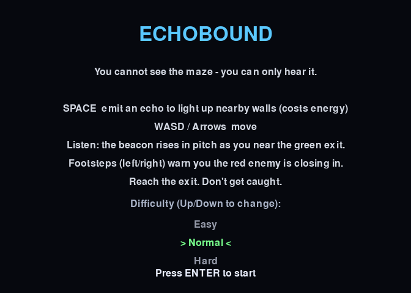
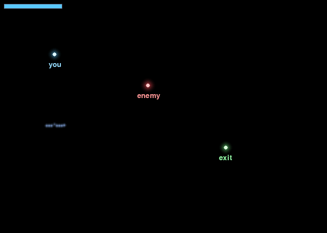
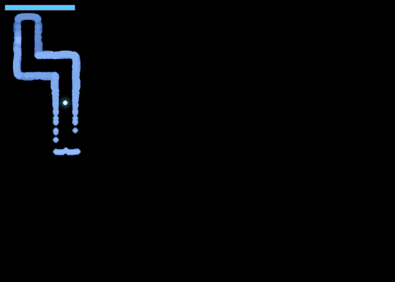
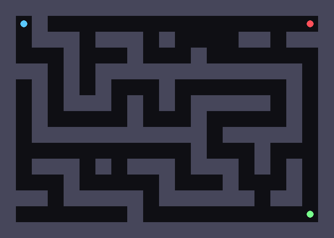

# Echobound

**You cannot see the maze — you can only hear it.**

Echobound is a top-down echolocation maze game built with Python and pygame. The screen is almost entirely black. Instead of seeing the walls, you press a key to send out a sound wave that ripples outward, strikes nearby surfaces, and briefly lights up their outline before the world fades back into darkness. You navigate a maze you have never actually seen — by memory, and by the fading echoes of your own pings — while an enemy that hunts by sound tries to reach you first.

## Screenshots

| Start menu | A single echo |
|---|---|
|  |  |

| The three elements (you / enemy / exit) | Memory map while exploring |
|---|---|
|  |  |

| Full maze (debug view — note the loops added by braiding) |
|---|
|  |

## How to play

| Key | Action |
|-----|--------|
| `SPACE` | Emit an echo (lights up nearby walls; costs energy) |
| Arrow keys / `WASD` | Move |
| `H` | Pause / help |
| `R` | Restart from level 1 |
| `1` / `2` / `3` | Choose difficulty on the start menu |

Reach the green exit to clear the level and advance to a harder one. Pinging is how you see — but every ping the enemy hears reveals your location, so use it wisely.

## Run it

You need Python 3 and two packages:

```bash
pip install pygame numpy
python echobound.py
```

`numpy` is only used for procedurally generated sound; the game still runs without audio if it is missing.

### Optional command-line flags

```bash
python echobound.py --seed 7              # deterministic maze
python echobound.py --enemy-speed 14      # tune enemy speed (lower = faster)
python echobound.py --fade 3              # tune how long lit walls linger
python echobound.py --render 320          # tune echo render distance
python echobound.py --shots               # render headless screenshots
```

## Algorithms used

This game was built as a course project, and each system draws on a different algorithm from the class:

- **Recursive Backtracker maze generation, with braiding** — carves a connected maze, then opens extra walls to add loops and junctions
- **Raycasting** — each ping casts ~180 rays that stop at the first wall, forming an expanding sonar wave-front
- **A\* pathfinding** — used two opposite ways: the enemy chases the last spot it *heard* you ping, while a BFS path distance drives an exit "beacon" tone that guides you
- **AABB / grid collision detection** — for movement and ray–wall tests
- **Stereo panning with distance falloff** — the enemy's footsteps are panned left/right by its position so you hear it approach from a direction
- **Radial glow with quadratic distance falloff** — lit walls and characters bloom as light out of darkness
- **Frame-to-frame interpolation** — smooth movement between grid cells

## How it works

The world is a grid of cells (wall or open). Each ping creates an expanding ring of rays; a ray lights up the first wall it hits, but only while the ring's radius is near that wall, so the light reads as a pulse sweeping outward. A separate "memory" layer holds previously lit surfaces and slowly fades them to black. The enemy moves on a timer and only updates its target when it hears a ping within range, so staying quiet keeps you hidden.
